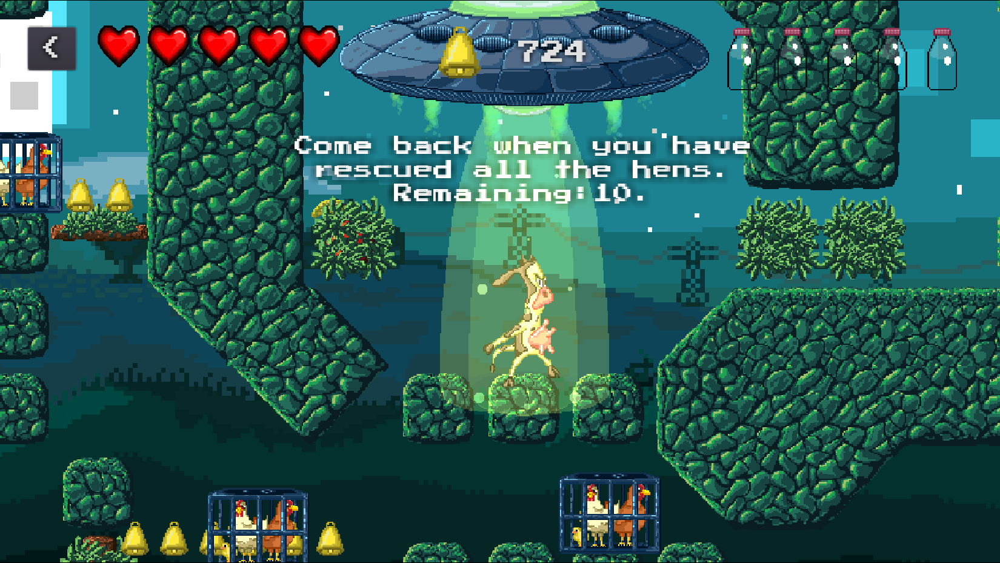

# Cow's Revenge

> You are a cow abducted and genetically improved by aliens which now have the opportunity to rebel against livestock industry by freeing the encaged hens and killing butchers. You used to be a regular cow raised as a dairy cow, but you ain't that anymore. You have become better. You are... THE COWEST.

Casual platform game project for learning purposes. Made with [godot engine 2.1.5](https://godotengine.org/).

Code licensed as [GPL v3](LICENSE_CODE), assets as [Creative Commons Attribution-NonCommercial-ShareAlike 4.0 International](https://creativecommons.org/licenses/by-nc-sa/4.0/).

## Screenshots

## Authors
  - **Daniel Darias Sánchez** [mastodon](https://mastodon.social/@darias), [email](dariasteam94@gmail.com)
      code, music, sprites, aniamtions
  - **Yanara Aristiguieta** [instagram](https://www.instagram.com/yanaronna/), [twitter](twitter.com/yanaronna), [email](needafreefall-@hotmail.com)
      sprites, character design, animations

## Additional information
All resources have been created using the following FLOSS:

- [krita](https://krita.org/en/)
- [audacity](http://www.audacityteam.org/)
- [tuxguitar](http://tuxguitar.com.ar/)
- [inkscape](https://inkscape.org/en/)
- [sfxr](http://www.drpetter.se/project_sfxr.html)

# Contributors and third party stuff

Shaders: [Enrique Lalves](https://github.com/henriquelalves/SimpleGodotCRTShader)
Font: [Press Start 2P by CodeMan38 (Open Font License)](https://fonts.google.com/specimen/Press+Start+2P?selection.family=Press+Start+2P)

- [Basxto](https://github.com/basxto)
